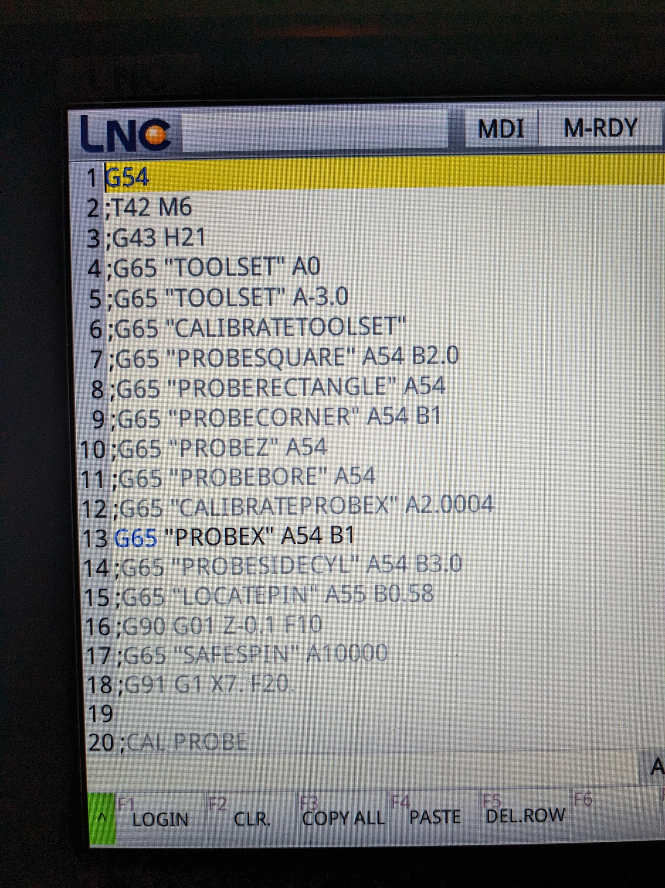

Basic Macros for probing and toolsetting on the Syil X7 with the LNC 6800 controller

# Instructions 

Call these as sub programs with G65. I found the M code call to be very slow. 

Most of these are pretty self explanatory, but the `PROBEX` and `PROBEY` macros bear a little explaining

	- These take two arguments: `A` is for the work offset. `B` is either `1` or `-1`
	- `B1` indicates that you're probing in the same direction as if you were probing on the back left corner of the fixed jaw. 
	- `B-1` gives opposite probe movement directions from `B1` :) 

# What is the SAFESPIN macro? 
	I occationally command a spindle RPM speed from MDI. However, on occation I may have forgotten to comment that back out when changing to my probe in MDI ... bad things happen when you spin probes :(

	I could not find any kind of tool-number based RPM limits to ensure the probe never spins. 
	Maybe I'm just missing it, but failing that I keep a bit in one of the wear values for the probe that flips to true whenever a probing routine is called. 
	The `SAFESPIN` macro checks that bit before calling any spindle rotations commands, and gives a big flashy warning message to help you remember not to spin you probe. 

	Why did I keep the bit in the wear table? I couldn't figure out where else to store it persistantly. I think there are some parameters memory locations I can get access to, but I haven't spent the time to figure out that syntax. 

# TODO
	- the `B` argument for `PROBEX` and `PROBEY` is kind of silly. I think it might be better just to input a numerical value that you wish the G31 to move in the given direction. The macro could be simplified quite a bit with that change as well. 
	- The `locatepin` macro is incomplete. It needs to be checked, verified, and some minor additions made so it actually saves the offsets. It should also be renamed to `probeboss`
	- The speed of the rectangular probing routine is pretty slow. For small work pieces its not a big deal, but if you probe a 12"x10" piece of stock it takes about 1 minute. A binary search algorithm with stepbacks would help this a lot. 
	- The `PROBEBORE` macro does not probe for the z-height. It would be nice to make that optional. 
	- The `PROBERECTANGLE` does not do a z-probe for the top of the stock. It would be nice to make that optional too. 
	- The `PROBEX`, `PROBEY`, and `PROBEZ` macros would all benefit slightly from adding a `C` argument where you could enter an additional offset, incase you are probing off a 123 block (or some other reference tool). 
	- Improve the probe tip diameter calibration routine to use a gague ring (at least optionally). Right now it just assumes a 123 block. 

# WISHLIST of stuff I don't yet know how to do
	- Add a `CHECKTOOL` macro that can look at the tool table and see if a tool number is present (would like to add this to the top of my postprocessor!)
	- Add a macro to check min/max values against soft-limits (would also like to add this to my post processor) 
	- Add a macro to calibrate the tool probe z value
	- Test out a spindle-position command in the probe diameter calibration. Probe at different spindle angles, and record the values. Then compute a true-center for the probe and store the various offsets as some kind of angle map. Use that to compensate for any probe runout. 

The spindle rotation command requires some kind of update from Mr. Chen. I installed it, but haven't had time to play with that yet. 

PRs are more than welcome. I've been using these for several months and haven't had any problems, but use at your own risk. Run all the macros in MPG Dry Run mode until you're sure they work. Don't blame me if you crash your machine or break a probe-tip :) 

