**SYIL X7 LNC6800 Probing Macro Guide**

Justin Gray

Joshua Smith

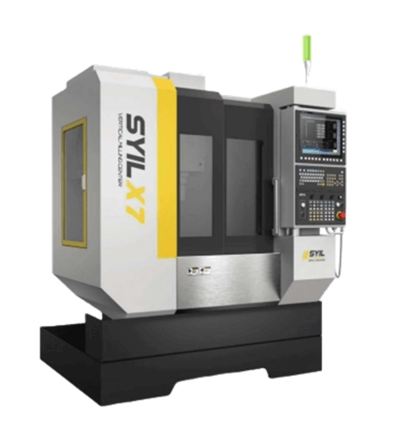

**Introduction**

The objective of this document is to provide guidance on the use of the provided open-source probing macros. The macros are meant to provide basic probing routines and support WCS probing within fusion360. They also serve as a reference for anyone interested in making their own custom macros. Community support and feedback is highly recommended, we are all in this together.

**Important Precautions**

The probing routines only support probes that don't require special macros to turn them on. Recommend probes included the drewtronics wireless probe or the Silver CNC Infrared Touch probe. All the macros need to be stored in the same file as your posted gcode programs. Always test the macros with MPG DRN the first time. SYIL configurates may change and we're not responsible for broken tips or machine crashes.

**Probe Configuration Macro**

Every probing routine calls the configuration macro to initialize global variables. It allows all probing parameters to be specified in one place. The probe configuration macro must be opened and customized to your specific needs. The various probing parameters must be set in your desired units. The default parameters are in inches but comments provide suggested metric values. Start with the recommended settings and fine tune from there. Please set your fusion360 probing feed rate to the same value that you use in the config macro. In you decide to change feed rates, you should always run calibration again.

**Macro Syntax**

Macros are called with G65 as opposed to M codes to speed up execution. G65 is followed by the macro name and whatever arguments need passed into the macro. The example below shows how to probe a square. The A argument is the work offset and the B argument is the width. Each argument starts with a letter followed by a value. For example, a macro requiring three arguments would have A#, B# and C# after the macro name. Simply copy the macro into the MDI and adjust the arguments according to your needs. A table mapping the macro arguments to local variables is also provided below. Extended G54 work offsets are supported with the use of a decimal point. For example, G54P5 can be entered into the A argument as G54.5.

| G Code | "Macro Name" | Macro Argument | Macro Argument |
| --- | --- | --- | --- |
| G65 | "PROBESQUARE" | A | B |

_Table 1: Macro Syntax and Example_

Example MDI Command: G65 "PROBESQUARE" A54 B2

Example MDI Command: G65 "PROBESQUARE" A54.5 B2

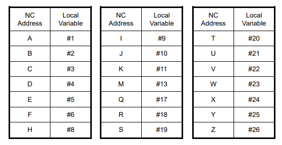

_Figure 1. Macro Argument to local variable mapping_

# Probe Calibration

**Basic Probe Setup**

Before performing any calibration routines your probe must be concentric. To make your probe concentric you must place a dial indicator on the ruby tip and rotate the probe in the spindle by hand. Adjust your probe until the dial indicator doesn't move or is within a few tenths. The height of your probe can be found using a tool setter if the force to trigger the tool setter is less than the probe. The Syil TTC-200 works with this method. If you don't have a tool setter, you can use a tool of known length and a 123 block. we recommend using a Maritool probe calibrator in this case.

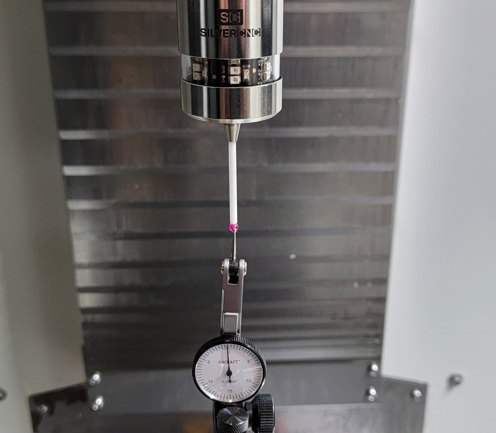

_Figure 2. Indicating Probe_

**CALIBRATEPROBEX**

| GCode | "Macro Name" | Macro Argument | Macro Argument |
| --- | --- | --- | --- |
| G65 | "CALIBRATEPROBEX" | A | B |

_Table 2. Calibrate Probe X Syntax_

**CALIBRATEPROBEY**

| G Code | "Macro Name" | Macro Argument | Macro Argument |
| --- | --- | --- | --- |
| G65 | "CALIBRATEPROBEY" | A | B |

_Table 3. Calibrate Probe Y Syntax_

**CALIBRATEPROBEDIAMETER**

The calibrate probe diameter macro uses a ring guage to calibrate the diameter of a probes ruby tip. It's important that the probe is concentric before beginning. The A argument is the work offset that the probe will center in. The B argument is the diameter of the ring guage. The probe must be inside of the guage and roughly centered. The routine will set the diameter of your probe tip and the radius can been seen in the tool table. If it's your first time running calibration, set the tool table radius to the factory radius of your probe. The macro doesn't care what your current radius is as long as it's within reason.

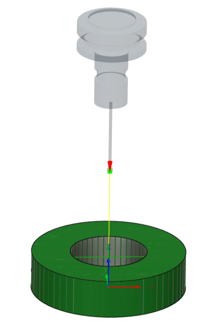

_Figure 3. Probe Diameter Calibration_

| G Code | "Macro Name" | Macro Argument | Macro Argument |
| --- | --- | --- | --- |
| G65 | "CALIBRATEPROBEDIAMETER" | A | B |

_Table 4. Calibrate Probe Radius Syntax_

Example MDI Command: G65 "CALIBRATEPROBEDIAMETER" A54 B2

# Probing Routines

**PROBEX**

The Probe X macro probes the side of a part in the X direction. The A argument is the selected work coordinate(G54-59). The B argument is the distance to probe in X. The X distance can be a positive or negative value depending on which side of the stock you would like to probe. If the X distance is too small, the macro will report an error at the end of the routine.

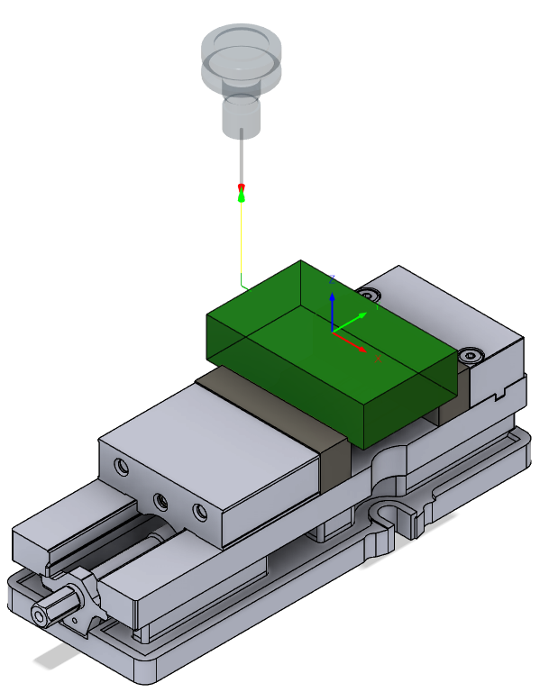

_Figure 4. Probe X Routine_

| G Code | "Macro Name" | Macro Argument | Macro Argument |
| --- | --- | --- | --- |
| G65 | "PROBEX" | A | B |

_Table 5. Probe X Syntax_

Example MDI Command To Probe Right Side: G65 "PROBEX" A54 B-1

Example MDI Command To Probe Left Side: G65 "PROBEX" A54 B1

**PROBEY**

The Probe Y macro probes the side of a part in the Y direction. The A argument is the selected work coordinate(G54-59). The B argument is the distance to probe in Y. The Y distance can be a positive or negative value depending on which side of the stock you would like to probe. If Y distance is too small, the macro will report an error at the end of the routine.

_Figure 5. Probe Y Routine_

| G Code | "Macro Name" | Macro Argument | Macro Argument |
| --- | --- | --- | --- |
| G65 | "PROBEY" | A | B |

_Table 6. Probe Y Syntax_

Example MDI Command To Probe the Front : G65 "PROBEY" A54 B1

Example MDI Command To Probe the Back  : G65 "PROBEY" A54 B-1

**PROBEZ**

The Probe Z macro probes the top surface of a part in the negative Z direction. The A argument is the selected work coordinate(G54-59). The B argument is the distance to probe in Z and should be a negative value. If the Z distance is too small or a positive value, the macro will report an error at the end of the routine.

_Figure 6. Probe Z Routine_

| G Code | "Macro Name" | Macro Argument | Macro Argument |
| --- | --- | --- | --- |
| G65 | "PROBEZ" | A | B |

_Table 7. Probe Z Syntax_

Example MDI Command: G65 "PROBEZ" A54 B-.5

**PROBEXWEB**

The Probe X Web macro probes two sides of the stock in the X direction and calculates the center. The A argument is the selected work coordinate(G54-59). The B argument is the length of the stock. The C argument is the distance the probe should move in Z below the edges of the stock. The D argument enables inspection reporting which pops up a calculated length after the routine finishes. The Probe should be roughly centered and above the stock before beginning.

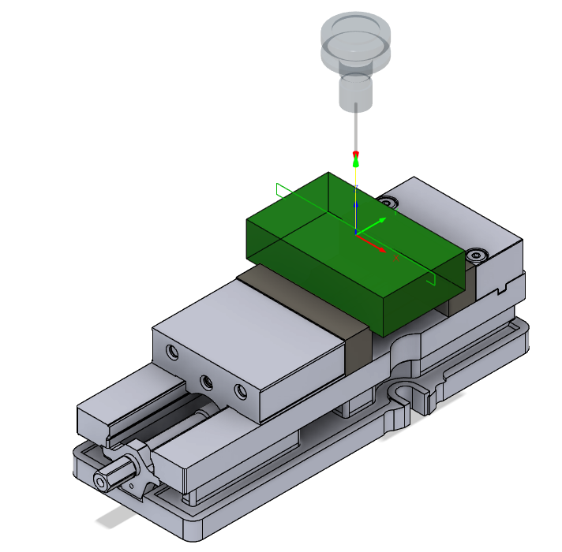

_Figure 7. Probe X Web Routine_

| GCode | "Macro Name" | Macro Argument | Macro Argument | Macro Argument | Macro Argument |
| --- | --- | --- | --- | --- | ---|
| G65 | "PROBEXWEB" | A | B | C | D |

_Table 8. Probe X Web Syntax_

Example MDI Command Without Inspection Report: G65 "PROBEXWEB" A54 B3 C-.5 D0

Example MDI Command With Inspection Report: G65 "PROBEXWEB" A54 B3 C-.5 D1
  
**PROBEYWEB**

The Probe Y Web macro probes two sides of the stock in the Y direction and calculates the center. The A argument is the selected work coordinate(G54-59). The B argument is the width of the stock. The C argument is the distance the probe should move in Z below the edges of the stock.  The D argument enables inspection reporting which pops up a calculated width after the routine finishes. The Probe should be roughly centered and above the stock before beginning.

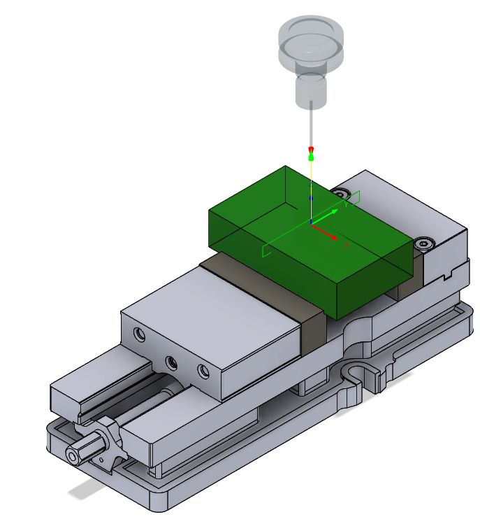

_Figure 8. Probe Y Web Routine_

| G Code | "Macro Name" | Macro Argument | Macro Argument | Macro Argument | Macro Argument |
| --- | --- | --- | --- | --- | --- |
| G65 | "PROBEYWEB" | A | B | C | D |

_Table 9. Probe Y Web Syntax_

Example MDI Command Without Inspection Report: G65 "PROBEYWEB" A54 B2 C-.5 D0

Example MDI Command With Inspection Report: G65 "PROBEYWEB" A54 B2 C-.5 D1

**PROBECIRCULARBOSS**

The Probe Circular Boss macro probes 4 points of a circular boss and calculates the center. The A argument is the selected work coordinate(G54-59). The B argument is the diameter of the stock. The C argument is the distance the probe should move in Z below the edges of the stock.  The D argument enables inspection reporting which pops up a calculated diameter after the routine finishes. The Probe should be roughly centered and above the stock before beginning.

_Figure 9. Probe Circular Boss Routine_

| G Code | "Macro Name" | Macro Argument | Macro Argument | Macro Argument | Macro Argument |
| --- | --- | --- | --- | --- | --- |
| G65 | "PROBECIRCULARBOSS" | A | B | C | D |

_Table 10. Probe Circular Boss Syntax_

Example MDI Command Without Inspection Report: G65 "PROBECIRCULARBOSS" A54 B2 C-.5 D0

Example MDI Command With Inspection Report: G65 "PROBECIRCULARBOSS" A54 B2 C-.5 D1
  
**PROBEBORE**

The Probe Bore macro probes 4 points inside of a bore and calculates the center. The A argument is the selected work coordinate(G54-59). The B argument is the diameter of the bore. The C argument enables inspection reporting which pops up a calculated diameter after the routine finishes. The Probe should be roughly centered and inside of the bore before beginning.

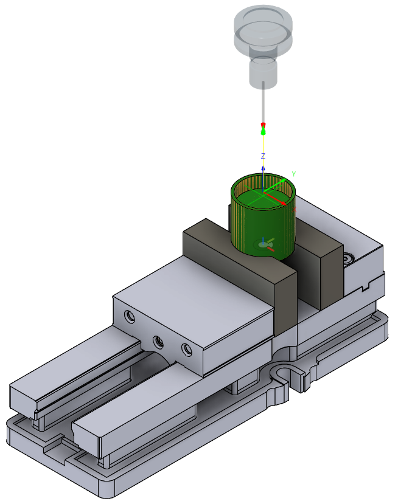

_Figure 10. Probe Bore Routine_

| G Code | "Macro Name" | Macro Argument | Macro Argument | Macro Argument |
| --- | --- | --- | --- | --- |
| G65 | "PROBEBORE" | A | B | C |

_Table 11. Probe Bore Syntax_

Example MDI Command Without Inspection Reporting: G65 "PROBEBORE" A54 B1 C0

Example MDI Command With Inspection Reporting: G65 "PROBEBORE" A54 B1 C1

  
**PROBERECTANGULARBOSS**

The Probe Rectangular Boss macro probes all sides of the stock and calculates the center. The A argument is the selected work coordinate(G54-59). The B argument is the distance the probe should move in Z below the edges of the stock and should be a negative value. The C argument is the length of the stock in X and the D argument is the width of the stock in Y. The E argument enables inspection reporting which pops up a calculated length and width after the routine finishes. The Probe should be roughly centered and above the stock before beginning.

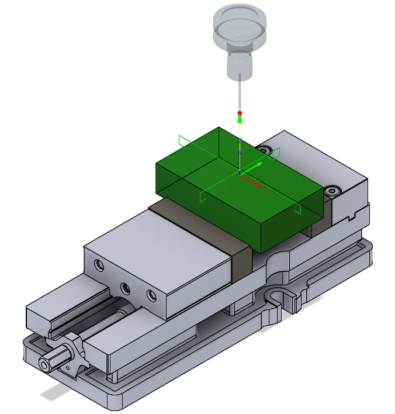

_Figure 11. Probe Rectangular Boss Routine_

| G Code | "Macro Name" | Macro Argument | Macro Argument | Macro Argument | Macro Argument | Macro Argument |
| --- | --- | --- | --- | --- | --- | --- |
| G65 | "PROBERECTANGULARBOSS" | A | B | C | D | E |

_Table 12. Probe Rectangular Boss Syntax_

Example MDI Command Without Inspect Reporting: G65 "PROBERECTANGULARBOSS" A54 B3 C2 D-.5 E0

Example MDI Command Without Inspect Reporting: G65 "PROBERECTANGULARBOSS" A54 B3 C2 D-.5 E1

  
**PROBEPOCKET**

The Probe Pocket macro probes all internal sides of a pocket and calculates the center. The A argument is the selected work coordinate(G54-59). The B argument is the length of the pocket in X and the C argument is the width of the pocket in Y. The D argument enables inspection reporting which pops up a calculated length and width after the routine finishes. The Probe should be roughly centered and inside of the pocket before beginning.

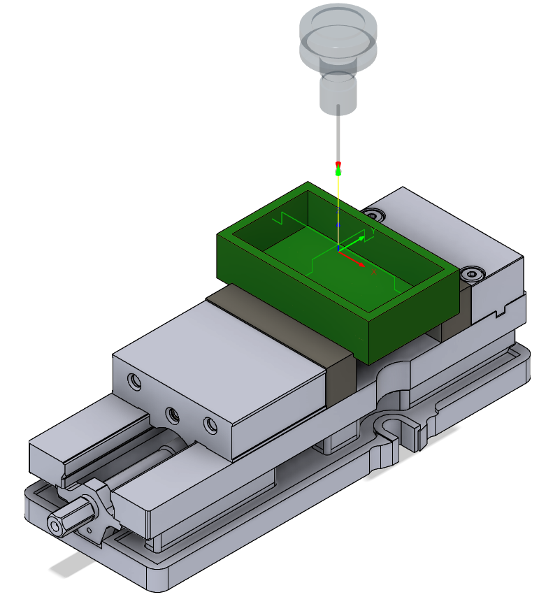

_Figure 12. Probe Pocket Routine_

| G Code | "Macro Name" | Macro Argument | Macro Argument | Macro Argument | Macro Argument |
| --- | --- | --- | --- | --- | --- |
| G65 | "PROBERECTANGULARPOCKET" | A | B | C | D |

_Table 13. Probe Rectangular Pocket Syntax_

Example MDI Command Without Inspection Reporting: G65 "PROBERECTANGULARPOCKET" A54 B2 C3 D0

Example MDI Command Without Inspection Reporting: G65 "PROBERECTANGULARPOCKET" A54 B2 C3 D1

  
**PROBEXSLOT**

The Probe Slot X macro probes the internal sides of a pocket in the X direction and calculates the center. The A argument is the selected work coordinate(G54-59). The B argument is the length of the pocket in X. The C argument enables inspection reporting which pops up a calculated length after the routine finishes. The Probe should be roughly centered and inside of the slot before beginning.

_Figure 13. Probe Slot Routine_

| G Code | "Macro Name" | Macro Argument | Macro Argument | Macro Argument |
| --- | --- | --- | --- | --- |
| G65 | "PROBESLOTX" | A | B | C |

_Table 14. Probe Slot Syntax_

Example MDI Command Without Inspectioning: G65 "PROBESLOTX" A54 B3 C0

Example MDI Command Without Inspectioning: G65 "PROBESLOTX" A54 B3 C1
  
**PROBEYSLOT**

The Probe Slot Y macro probes the internal sides of a pocket in the Y direction and calculates the center. The A argument is the selected work coordinate(G54-59). The B argument is the width of the pocket in Y. The C argument enables inspection reporting which pops up a calculated width after the routine finishes. The Probe should be roughly centered and inside of the slot before beginning.

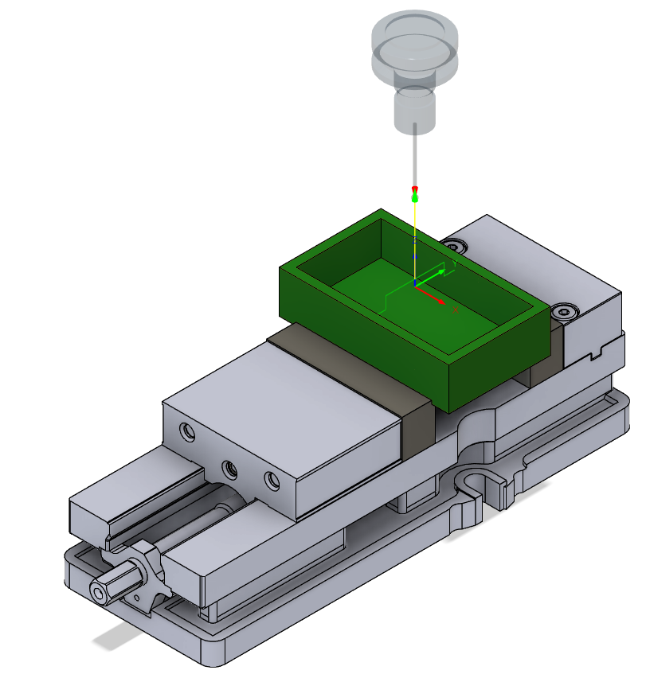

_Figure 14. Probe Slot Routine_

| G Code | "Macro Name" | Macro Argument | Macro Argument | Macro Argument |
| --- | --- | --- | --- | --- |
| G65 | "PROBESLOTY" | A | B | C |

_Table 15. Probe Slot Syntax_

Example MDI Command Without Inspection Reporting: G65 "PROBESLOTY" A54 B3 C0

Example MDI Command With Inspection Reporting: G65 "PROBESLOTY" A54 B3 C1

  
**PROBEOUTSIDECORNER**

The Probe Outside Corner macro probes the outside edges of the stock and calculates the center. The A argument is the selected work coordinate(G54-59). The B argument Selects the desired corner to probe. The C argument is the distance to travel away from the inital location before probing begins. The D argument is the probing distance for both X and Y. The Probe should be roughly centered, above and in front of the corner before beginning.

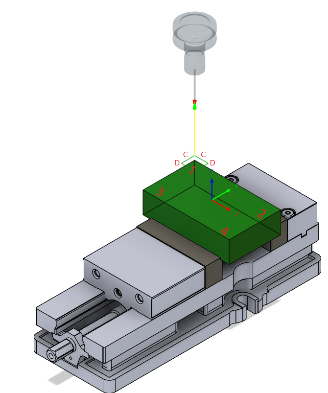

_Figure 15. Probe Outside Corner Routine_

| G Code | "Macro Name" | Macro Argument | Macro Argument | Macro Argument | Macro Argument |
| --- | --- | --- | --- | --- | --- |
| G65 | "PROBEOUTSIDECORNER" | A | B | C | D |

_Table 16. Probe Outer Corner Syntax_

Example MDI Command: G65 "PROBEOUTSIDECORNER" A54 B1 C1 D.5

  
**PROBEINSIDECORNER**

The Probe inside Corner macro probes the inside edges of a pocket and calculates the center. The A argument is the selected work coordinate(G54-59). The B argument Selects the desired corner to probe. The C argument is the probing distance. The Probe should be roughly centered, above and behind the corner before beginning.

_Figure 16. Probe Inside Corner Routine_

| G Code | "Macro Name" | Macro Argument | Macro Argument | Macro Argument |
| --- | --- | --- | --- | --- |
| G65 | "PROBEINSIDECORNER" | A | B | C |

_Table 17. Probe Inner Corner Syntax_

Example MDI Command: G65 "PROBEINSIDECORNER" A54 B1 C.5

# What is the SAFESPIN macro? 

	I occationally command a spindle RPM speed from MDI. However, on occation I may have forgotten to comment that back out when changing to my probe in MDI ... bad things happen when you spin probes :(

	I could not find any kind of tool-number based RPM limits to ensure the probe never spins. 
	Maybe I'm just missing it, but failing that I keep a bit in one of the wear values for the probe that flips to true whenever a probing routine is called. 
	The `SAFESPIN` macro checks that bit before calling any spindle rotations commands, and gives a big flashy warning message to help you remember not to spin you probe. 

	Why did I keep the bit in the wear table? I couldn't figure out where else to store it persistantly. I think there are some parameters memory locations I can get access to, but I haven't spent the time to figure out that syntax. 

# TODO

	- Change the aquisition of machine coordinates in each macro to use the R_skip function to compensate for minute overshoot after the probe triggers.
	- The `PROBEBORE` macro does not probe for the z-height. It would be nice to make that optional. 
	- The `PROBERECTANGLE` does not do a z-probe for the top of the stock. It would be nice to make that optional too. 
	- Improve the probe tip diameter calibration routine to use a gague ring (at least optionally). Right now it just assumes a 123 block. 
    - remove calibratex and calibratey with the addition of ring guage macro (need to make sure Justin agrees) 

# WISHLIST of stuff I don't yet know how to do

	- Add a `CHECKTOOL` macro that can look at the tool table and see if a tool number is present (would like to add this to the top of my postprocessor!)
	- Add a macro to check min/max values against soft-limits (would also like to add this to my post processor) 
	- Add a macro to calibrate the tool probe z value
	- Test out a spindle-position command in the probe diameter calibration. Probe at different spindle angles, and record the values. Then compute a true-center for the probe and store the various offsets as some kind of angle map. Use that to compensate for any probe runout. 

The spindle rotation command requires some kind of update from Mr. Chen. I installed it, but haven't had time to play with that yet. 

PRs are more than welcome. I've been using these for several months and haven't had any problems, but use at your own risk. Run all the macros in MPG Dry Run mode until you're sure they work. Don't blame me if you crash your machine or break a probe-tip :) 
